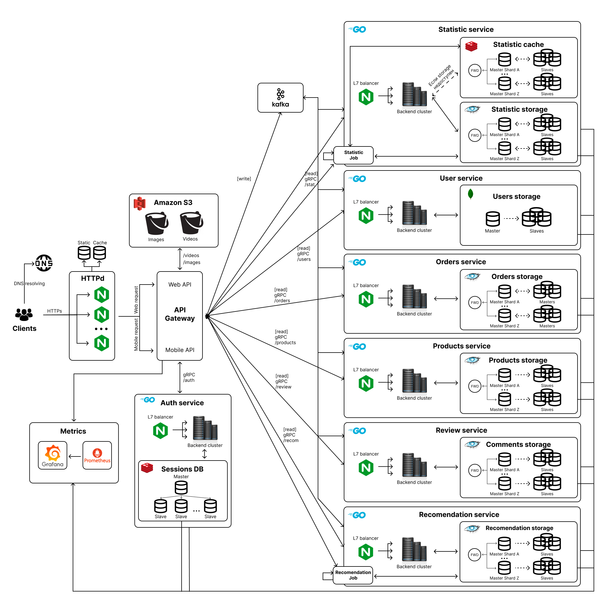

# Курсовая работа
> [Задание](https://github.com/init/highload/blob/main/homework_architecture.md)

## 1. Тема и целевая аудитория
Amazon — американская компания, крупнейшая в мире на рынках платформ электронной коммерции и публично-облачных вычислений по выручке и рыночной капитализации.

### MVP
 - Регистрация пользователей (покупателей и продавцов), управление аккаунтом
 - Поиск и просмотр товаров в каталоге
 - Добавление товаров в корзину
 - Оформление заказа
 - Отзывы и рейтинти товаров
 - Создание товаров (для продавцов)
 - Управление заказами, осуществление их отправки, доставки, возвратов

### Целевая аудитория [[1]](https://www.similarweb.com/ru/website/amazon.com/#traffic)
 - Общее количество визитов в месяц: 2.6 млрд (с настольных компьютеров и мобильных устройств)
 - Число уникальных пользователей в месяц (MAU) в США - 230 млн [[2]](https://www.statista.com/statistics/271412/most-visited-us-web-properties-based-on-number-of-visitors/)
     > Как я не искал, по всему миру этой статистики не нашел
 
**Распределение по странам:**
 1. США - 82.95%
 2. Канада - 1.09%
 3. Индия - 1.06%
 4. Великобритания - 0.97%
 5. Япония - 0.84%
 6. Другие страны - 13.10%

**Демография аудитории:**
 - Распределение по полу: 45.99% женщины и 54.01% мужчины
 - Самая многочисленная возрастная группа — 25-34 лет (29.18%)
    - 35-44: 19.24%
    - 18-24: 17.29%
    - 45-54: 15.21%
    - 55-64: 11.79%
    - 65+: 7.28%

## 2. Расчет нагрузки

### Продуктовые метрики
 - Месячная аудитория - 213 млн [[2]](https://www.statista.com/statistics/271412/most-visited-us-web-properties-based-on-number-of-visitors/)
 - Дневная аудитория - 28 млн [[3]](https://vc.ru/trade/594954-top-zarubezhnyh-marketpleysov-dlya-prodazhi-tovarov-v-2023-amazon-etsy-i-drugie)
 - Средний размер хранилища пользователя: ~1Мб
    > В хранилище пользователя входяд его заказы, личные и платежные данные, адреса и тп.
 - Среднее количество действий пользователя по типам в день:
    - Amazon имеет 9.5 млн продавцов (из них более 2.5 млн активных); каждый день к Amazon присоединяется более 2,000 новых продавцов [[4]](https://www.affiliatebay.net/ru/amazon-statistics/). Предположим, что продавцов на площадке - 10%, тогда в день новых пользователей - 200000
    - 66% пользователей сервиса для поиска товаров предпочитают Amazon, а не глобальный поиск [[5]](https://www.statista.com/statistics/235681/online-shoppers-digital-channels-of-choice-to-learn-about-products/). предположим, что поиск используется в 1 из 10 случаев.
    - Предположим, что покупатель в среднем открывает 1-2 товара, который отобразился в каталоге/поиске
    - Предположим, что в корзине в среднем 2 товара, а покупатель покупает каждый второй товар из корзины 
    - Количество отправленных в день посылок: 1.6 млн [[6]](https://market.us/statistics/e-commerce-websites/amazon/)
    - 2-5% пользователей оставляют ревью после покупки товара [[7]](https://www.quora.com/What-percentage-of-buyers-write-reviews-on-Amazon)
    - Только Amazon продает более 12 миллионов товаров. Если принять во внимание сторонних продавцов, на Amazon Marketplace продается более 353 миллионов товаров. [[8]](https://0ca36445185fb449d582-f6ffa6baf5dd4144ff990b4132ba0c4d.ssl.cf1.rackcdn.com/IG_360piAmazon_9.13.16.pdf)

    **Итого:**

    | Действие        | Формула | Количество в день (на 1 пользователя) |
    | ------------- |:-------------:|:-------------:|
    | Регистрация | 200000 (регистраций в день) / 28 млн (DAU) | 0.0007 |
    | Поиск      | 0.66 (часть пользователей, который используют поиск) * 0.1 (часть, которая приходится на поиск) * 28 млн (DAU) / 28 млн (DAU) | 0.066      |
    | Просмотр каталога     |  0.9 (часть, которая приходится на просмотр каталога) * 28 млн (DAU) / 28 млн (DAU) | 0.9      |
    | Просмотр товара      |  (0.9 + 0.66 * 0.1) (пользователи, которые пришли из каталога и поиска) * 28 млн (DAU) * 1.5 (1-2 товар открывает) / 28 млн (DAU) | 1.45      |
    | Добавление в корзину | 1.45 (просмотр товара) * 2 (2 товара в корзине в среднем) | 2.9  |
    | Оформление заказов | 2.9 (добавление в корзину) * 0.5 (каждый второй товар покупается) | 1.45 |
    | Добавление отзыва | 1.45 (оформление заказов) * 0.035 (2-5% пользователей оставляют ревью) | 0.05  |
    | Создание товаров | 1.6 млн (количество посылок в день) * 2 (2 товара в корзине) / 28 млн (DAU) | 0.1     |
    | Отправка заказов | 1.6 млн (количество посылок в день) / 28 млн (DAU) | 0.05      |

### Технические метрики

#### RPS

Чтобы подсчитать средний RPS нужно данные, полученные в продуктовых метриках умножить на DAU (так как считали на 1 пользователя) и поделить на количество секунд в дне (так как считали количество действий в день).

Предположим, что в пике нагрузка вырастает в 2 раза.

**Итого**

| Действие        | Средний RPS | Пиковый RPS |
| ------------- |:-------------:|:-------------:|
| Регистрация      | 5   | 10 |
| Поиск | 513  | 1026 |
| Просмотр каталога | 7000  | 14000 |
| Просмотр товара | 11278  | 22556 |
| Добавление в корзину  |  22556  | 45112 |
| Оформление заказов |  11278  | 22556 |
| Добавление отзыва |  389  | 778 |
| Создание товаров |  778  | 1556 |
| Отправка заказов | 389  | 778 |

#### Трафик

Посчитаем количество товаров на каждой из основых страниц:
> Выделим только основные, в которых гоняется много данных по сети (например, регистрацию, добавление отзывов и добавление в корзину учитывать не будем)

 1. Поиск: на странице находится 12 товаров + в ленте рекомендаций еще 15 товаров (27 предпоказов)
 2. Просмотр каталога: на странице находится 24 товара + в ленте рекомендаций еще 15 товаров (39 предпоказов)
 3. Просмотр товара: 1 товар + 20 товаров, которые предлагаются купить в комплекте + в ленте рекомендаций еще 15 товаров (1 полноценный товар и 35 предпоказов)
 4. Создание товара: 1 товар

На предпоказ товара требуется:
 - Краткое описание + рейтинг ~1Кб
 - Сжатая картинка ~300Кб

Информация о товаре весит ~15Мб:
   - 8 картинок, каждая по 500Кб= 4Мб
   - описание товара, отзывы ~ 1Мб
   - видео о товаре на минуту ~ 10 Мб

Получаем:

| Действие         | RPS | Трафик | 
| ------------- |:-------------:| :-------: |
| Поиск        | 513 | 513 * 27 * 301Кб ~ 3.98Гб|
| Просмотр каталога | 7000 | 7000 * 39 * 301Кб ~ 78.3Гб |
| Просмотр товара    | 11278 | 11278 * (35 * 301Кб + 1 * 15Мб) ~ 278.5Гб|
| Создание товара   | 778 | 778 * 1 * 15Мб ~ 11.4Гб|

**Итого** 
 - Трафик в секунду: 3.98Гб + 78.3Гб + 278.5Гб + 11.4Гб = **372.18 Гб/с** = **2977.44 Гбит/с**
 - Трафик в сутки: 372.18 Гб/с * 60 * 60 * 24 = **30.67 Пб/сут**

**Пиковый**

Если трафик вырастет в 2 раза, то:
 - Трафик в секунду: **5954.88 Гбит/с**
 - Трафик в сутки: **61.34 Пб/сут**

Подсчитаем, сколько дополнительной памяти понадобится хранилищу через год.

Основное действие по заполнению хранилища - добавление товара (15Мб на товар), кроме этого, учтем, что средний размер хранилища пользователя составляет 1Мб.

Тогда:
 - В день новых пользователей - 200000 = 200000Мб или 195Гб; в год  это 69Тб
 - RPS создания товара 778, один товар - 15Мб; это 11.4Гб/с или 342.86Пб в год

Получаем **342.93Пб в год**.

## Глобальная балансировка нагрузки

### Расположение датацентров

Исходя из предоставленного выше распределения, основной фокус следует сделать на размещении датацентров в США, где находится наибольшее число пользователей (82.95%).

Страны, где наиболее распространен Amazon представлены ниже:

Размешение датацентров в разных густонаселенных городах США, таких как Нью-Йорк, Лос-Анджелес, Чикаго и Сан-Франциско, поможет обеспечить более низкую задержку при обработке запросов пользователей, а также снизит риски, связанные с отказом отдельного центра.

Исходя из распределения стран, дополнительные датацентры стоит расположить в Европе (Амстердам) и в Азии (Гонконг). Это поможет снизить задержку и улучшить производительность для пользователей из этих регионов.

### Глобальная балансировка

Для глобальной балансировки можно использовать GeoDNS, который позволит направлять пользователей на ближайший доступный сервер на основе их географического местоположения. При использовании GeoDNS, при выполнении запросов DNS - имя пользователя будет разрешаться в IP-адрес сервера, ближайшего к пользователю с учетом его местоположения. Затем с балансировка производится помощью BGP Anycast.

## Локальная балансировка нагрузки

Входящие запросы: на первом уровне, балансировка нагрузки осуществляется посредством аппаратного балансировщика типа F5 Networks. Он обладает широким функционалом, позволяет распределять нагрузку между серверами, обрабатывать SSL-шифрование, предотвращать DDoS-атаки и т.д.

Следующий этап - балансировка нагрузки на уровне сети или транспорта (IP/ TCP / UDP). Здесь может быть использовано программное решение - Nginx, к примеру. Он позволяют балансировать нагрузку по алгоритмам, таким как Round Robin или Least Connections.

Балансировка приложений (Layer 7): на данном уровне запросы распределяются на основе контента. Решением для этого может служить, например, Envoy. Он обладает мощными возможностями по балансировке нагрузки, поддерживает gRPC и, что важно, создавался с учетом потребностей микросервисных архитектур.

Отказоустойчивость: для обеспечения постоянной доступности сервиса даже при отказе отдельных узлов необходимо применение протокола поддержания доступности, такого как Keepalived.

Для повышения безопасности можно использовать PFS, а Session Cache для улучшения производительности, а для для обеспечения SSL-сертификации сервис Let’s Encrypt.

## Логическая схема БД

### Рассчёт занимаемого дискового пространства

Посчитаем, сколько за год потребуется дополнительной памяти.

**Типы данных в БД:**
 - varchar(x) - X Б 
 - boolean - 1 Б
 - bytea - 32 Б (+-)
 - int - 4 Б
 - bigint - 8 Б
 - timestamp - 8 Б
 - double - 8 Б
 - enum - 4 Б

**Допущения при рассчете:**

- 20000 регистрация в день - это 7.3 млн в год
- Считаем, что в среднем у пользователя только один способ оплаты, а также, один адрес получения
- В среднем у пользователя 2 товара в корзине, каждый второй товар покупается (= удаляется из корзины). Будем считать, что одновременно у каждого пользователя 1 товар в корзине
- Пусть и каждого продавца в среднем по одному магазину. Всего продавцов регистрируется 2000 ежедневно или 0.73 млн в год
- 0.1 - количество добавлений товара в день на 1 пользователя, тогда в год на всех продавцов это 0.1 * 365 * 0.73 млн = 266 млн
- В каждом товаре максимально 8 фоток и 1 видео = 9 медиа на товар = 2394 млн строк
- Пусть на каждый товар в среднем по 20 отзывов, тогда это 5320 млн
- У амазона 23 главных категории, в каждой из которых примерно по 10 подкатегорий
- 1.45 - количество оформлений заказов в день на 1 пользователя, тогда в год на всех пользователей это 3863 млн
- На одного пользователя в среднем одна сессия
- В таблице с самыми популярными товарами пусть будет по 20 товаров с каждого магазина по каждой категории (в среднем, считаем что на один магазин - 6 категорий товаров). Тогда общее количество строк в таблице - 0.73 млн (количество магазинов) * 20 (берем 20 товаров с магазина) * 6 (в среднем шесть категорий у одного магазина) = 88 млн строк
- В таблице с рекомендациями находятся рекомендации только для самых популярных товаров => строк столько же, сколько в таблице самых популярных (считаем, что на каждый товар - примерно 10 рекомендаций)

| Таблица         | Строк (млн) | Данных на строку | Всего | 
| ------------- |:-------------:| :-------: | :-------: |
| users        | 7.3 | 8 + 30 + 50 + 32 + 50 + 50 + 1 + 8 + 8 = 237 Б | 1.6 Гб |
| recipients |  7.3 | 8 + 50 * 6 + 4 * 2 + 20 + 100 + 8 = 444 Б | 3.02 Гб |
| payments_details    | 7.3 | 8 + 16 + 8 + 32 + 8 = 72 Б | 0.49 Гб |
| shopping_cards  | 7.3 | 8 + 4 + 8 = 20 Б| 0.14 Гб |
| stores  | 0.73 | 8 + 50 + 200 + 8 = 266 Б| 0.18 Гб |
| products  | 266 | 8 + 50 + 200 + 4 + 8 * 9 + 8 + 8 + 8 = 358 Б| 87 Гб |
| media  | 2394 | 8 + 100 + 50 = 158 Б| 352 Гб |
| comments  | 5320 | 8 + 200 + 4 + 8 * 3 = 236 Б| 1169 Гб |
| categories (без parent_id)  | 0.000023 | 8 + 50 = 58 Б| 1.3 Мб |
| categories (с parent_id)  | 0.000253 | 8 + 50 + 8 = 66 Б| 16 Мб |
| orders  | 3863 | 8 + 4 + 8 + 10 + 8 * 4 = 62 Б| 223 Гб |
| sessions | 7.3 | 8 + 100 + 8 + 8  = 124 Б| 0.84 Гб|
| product_statistics| 266 | 8 * 6 = 48 Б | 11.9 Гб |
| store_statistics| 0.73 | 8 * 3 = 24 Б | 0.02 Гб |
| most_popular_products | 88 | 8 + 8 + 8 + 8 = 32 Б | 2.6 Гб | 
| recomendation_products | 88 | 8 + 10 * 8 + 4 = 92 Б | 7.5 Гб | 

**Итого:** ~1880 Гб в год или 1.84 Пб (без учета медиа - они были выше)

## Физическая схема БД

Модель данных выглядит достаточно сложной и масштабируемой, что делает использование нереляционных баз данных привлекательным вариантом. В качестве основных СУБД лучше будет использовать Cassandra и MongoDB.

`Stores`, `Products`, `Comments`, `Orders`, `Product_statistics`, `Store_statistics`, `most_popular_products` и `recomendation_products`: Эти таблицы обладают большим размером данных и активно используются, что делает Casandra идеальным выбором из-за ее высокой доступности и производительности. Cassandra также поддерживает шардирование, что позволяет эффективно распределить данные на узлы и обеспечить горизонтальное масштабирование.

`Users`, `Recipients`, `Payments_details`, `Shopping_carts`: MongoDB позволяет эффективно обрабатывать наборы данных. Благодаря гибкости и возможности непосредственного хранения массивов данных в документах.

Для `Sessions` будет использоваться Redis, а для `Media` - Amazon S3 (Simple Storage Service), что обеспечит высокую доступность и надежность, а также масштабируемость для обработки огромных объемов данных.

### Описание таблиц

Опишем детали БД для каждой из таблиц. Будем классифицировать размер таблиц, частоту чтения и записи. Опишем индексы и применяемые технологии.

#### Media

 - **Размер:** высокий
 - **Частота чтения:** высокая
 - **Частота записи:** средняя

#### Sessions

Таблица, которая хранит сессии пользователей.

 - **Размер:** средний
 - **Частота чтения:** средняя
 - **Частота записи:** средняя
 - **Репликация:** master-slave
 - **Индексы:**
   - `cookie_token` - для быстрого поиска сессии

#### Users

Таблица пользователей, которая содержит всю необходимую информацию о пользователях.

 - **Размер:** средний
 - **Частота чтения:** средняя
 - **Частота записи:** низкая
 - **Индексы:**
   - `user_id` - PK
 - **Денормализация:** допольнительно хранить список id адресов и список id платежных данных
 - **Репликация:** master-slave

#### Recipients 

Таблица адресов пользователей (у каждого пользователя может быть несколько адресов). Содержит адрес и информацию о получателе.

 - **Размер:** средний
 - **Частота чтения:** высокая
 - **Частота записи:** низкая
 - **Индексы:**
   - `recipient_id` - PK
   - `auther_id` - FK
 - **Репликация:** master-slave

#### Payments_details

Таблица способов оплаты пользователей (у каждого пользователя может быть несколько адресов), Содержит всю необходимую информацию о способе оплаты.

 - **Размер:** средний
 - **Частота чтения:** высокая
 - **Частота записи:** низкая
 - **Индексы:**
   - `detail_id` - PK
   - `user_id` - FK
 - **Репликация:** master-slave

#### Shopping_carts

Таблица, хранящая информацию о товарах в корзине.

 - **Размер:** средний
 - **Частота чтения:** высокая
 - **Частота записи:** высокая
 - **Индексы:**
   - `user_id` - PK
 - **Денормализация:** допольнительно хранить список id товаров, которые находятся в корзине 
 - **Репликация:** master-master

#### Stores

Таблица магазинов, которая содержит информацию о нем.

 - **Размер:** низкий
 - **Частота чтения:** высокая
 - **Частота записи:** низкая
 - **Индексы:**
   - `store_id` - PK
   - `user_id` - FK
 - **Репликация:** master-slave

#### Products 

Таблица товаров, которая содержит информацию о товаре.

 - **Размер:** высокий
 - **Частота чтения:** высокая
 - **Частота записи:** средняя
 - **Индексы:**
   - `product_id` - PK
   - `store_id + price` - составной индекс (для получения товаров из конкретного магазина(-ов) + фильтрация/сортировка по цене)
   - `store_id + raiting` - составной индекс (для получения товаров из конкретного магазина(-ов) + фильтрация/сортировка по рейтингу)
 - **Шардирование:** по `store_id`
 - **Денормализация:** допольнительно хранить список id медиа файлов
 - **Репликация:** master-slave

#### Comments

Таблица отзывов о товаре.

 - **Размер:** высокий
 - **Частота чтения:** высокая
 - **Частота записи:** низкая
 - **Индексы:**
   - `comment_id` - PK
   - `user_id` - FK (используется при запросе отзывов конкретного пользователя)
   - `product_id` - FK (используется при запросе отзывов на конкретный товар)
 - **Шардирование:** по `product_id` 
 - **Репликация:** master-slave

#### Orders

Таблица заказов.

 - **Размер:** высокий
 - **Частота чтения:** высокая
 - **Частота записи:** высокая
 - **Индексы:**
   - `order_id` - PK
   - `user_id + created_at` - составной индекс (для получения заказов конкретного пользоваля + сортировки по самым новым/старым)
 - **Шардирование:** по `user_id`
 - **Денормализация:** допольнительно хранить список id товаров, которые находятся в заказе 
 - **Репликация:** master-master

#### Product_statistic 

Таблица статистики о товарах.

 - **Размер:** высокий
 - **Частота чтения:** высокая
 - **Частота записи:** низкая
 - **Индексы:**
   - `product_id` - PK
 - **Шардирование:** по `product_id`
 - **Репликация:** master-slave

#### Store_statistic

Таблица статистики о магазинах.

 - **Размер:** низкий
 - **Частота чтения:** высокая
 - **Частота записи:** низкая
 - **Индексы:**
   - `store_id` - PK
 - **Репликация:** master-slave

#### Most_popular_products  

Таблица самых популярных товаров по магазинам и категориям.

 - **Размер:** высокий
 - **Частота чтения:** высокая
 - **Частота записи:** низкая
 - **Индексы:**
   - `store_id` - FK
 - **Шардирование:** по `store_id`
 - **Репликация:** master-slave

> Был выбран `store_id`, а не `category`, так как у него намного выше селективность.

#### Recomendation_products  

Таблица рекмоендованных товаров.

 - **Размер:** высокий
 - **Частота чтения:** высокая
 - **Частота записи:** низкая
 - **Индексы:**
   - `product_id` - PK
 - **Шардирование:** по `product_id`
 - **Репликация:** master-slave

### Клиентские библиотеки

Основной язык бэкенда - Go, поэтому рассмотрим коннекторы для него:

1. Cassandra - `gocql` (является одной из самых популярных для работы с Cassandra)
2. MongoDB - `mongo-driver`
3. Redis - `go-redis` (популярный клиент Redis для Go)
4. Amazon S3 - `aws-sdk-go` (официальный SDK Amazon Web Services (AWS) для Go. Позволяет работать с Amazon S3 и выполнять операции с бакетами, объектами, доступами и другими функциональностями S3)

### Схема резервного копирования

1. Регулярное создание резервных копий: регулярные резервные копии БД должны быть созданы для обеспечения сохранности данных. Резервные копии могут быть созданы как полные снимки БД, так и инкрементальные копии, которые сохраняют только измененные данные с момента предыдущей резервной копии.
2. Распределение резервных копий: резервные копии БД должны быть сохранены в распределенном и отказоустойчивом хранилище данных.
3. Репликация данных: для обеспечения дополнительной защиты от потери данных, используется механизм репликации данных.

## Алгоритмы

### Рекомендации товаров

Можно использовать несколько стратегий рекомендации товаров:

1. Для новых пользователей, о вкусах которых еще ничего не известно, можно использовать стратегию "Самое популярное" по категориям и по магазинам. Оценка каждого товара рассчитывается как взвешенная сумма всех взаимодействий с ним: покупок, добавлений в корзину и просмотров. Система оценивает свежие взаимодействия выше, чем прошлые.

    > Алгоритм берет данные из статистики товаров, распределяет их по категориям и магазинам и сохраняет их в таблицу `most_popular_products`. Когда приходит запрос с конкретным магазином или категорией - данные просто берутся из таблицы.

2. Рекомендации на основе товаров (или "С этим часто покупают"). В рамках этой стратегии пользователю рекомендуются товары, которые часто покупают в связке с тем товаром, который он сейчас смотрит. 

    Для реализации этой стратегии можно использовать методы ассоциативного анализа, такие как алгоритм Apriori, который позволяет выявлять часто встречающиеся комбинации товаров в покупках. При просмотре определенного товара, система может рекомендовать товары, встречающиеся вместе с ним в чаще всего в покупках.

3. Аналогичные товары. Пользователю показываются товары, подобные тому, которые он сейчас смотрит, и расставленные по популярности.

    Для выявления аналогичных товаров с высокой оценкой подобия можно использовать алгоритмы коллаборативной фильтрации или контентной рекомендации. Например, коллаборативная фильтрация может анализировать историю покупок и предлагать товары, купленные другими пользователями с похожими предпочтениями. Контентная рекомендация может анализировать характеристики товаров, такие как категории, ключевые слова, и вычислять их подобие для предложения пользователю похожих товаров.
   
4. Интеграция с внешними сервисами. Сбор данных с других ресурсов, помимо самой торговой площадки Amazon.

> Алгоритмы 2-3 берут все товары из таблицы `most_popular_products` и для каждого из них подбирают товары (те, с которыми часто покупают текущих товар или аналогичные текущему товару), результаты записываются в таблицу `recomendation_products` с соотвествующим значением поля `recon_category`, а при необходимости подобрать рекомендации для конкретного товара - данные достаются из нее.

Все алгоритмы работают асинхронно (допустим, раз в 8 часов).
   

### Защита от мошенничества и модерация

Алгоритмы могут строиться на машинном обучении. Основное его применение, используемого для обнаружения мошенничества, - это прогнозирование.

Как правило, данные будут разделены на три разных сегмента — обучение, тестирование и перекрестная проверка. Алгоритм будет обучен на частичном наборе данных и параметров, измененных в тестовом наборе. Производительность данных измеряется с помощью набора перекрестных проверок. Затем высокопроизводительные модели будут протестированы для различных случайных разбиений данных, чтобы обеспечить согласованность результатов. Для принятия решений могут использоваться алгоритмы логистическая регрессии, дерева решений и случайного леса.

Кроме того, можно добавить верификацию продавца через, например, загрузку документов и фотографий с этими документами.

Благодаря этому, можно будет обнаруживать злоумышленников, которые хотят украсть данные пользователей, накрутки отзывов и прочее.

## Технологии

### Backend

Для создания сервиса будет использована микросервисная архитектура предпочтительна масштабируемого и гибкого сервиса. Она позволит разделить функциональность на независимые микросервисы, каждый из которых будет отвечать за определенный аспект функциональности. Можно выделить несколько микросервисов: сервис авторизации и аутентификации, сервис пользователей (информация о них, корзина), сервис управления заказами, сервис управления каталогом товаров и сервис оценок. 

Микросервисная архитектура имеет ряд преимуществ: 

1. Гибкость. Микросервисная архитектура обеспечивает гибкость в разработке и поддержке. Каждый микросервис может быть разработан и развернут независимо друг от друга, что позволяет быстро вносить изменения или внедрять новую функциональность без прерывания всего приложения.

2. Масштабируемость. Микросервисы могут быть масштабированы независимо друг от друга в зависимости от нагрузки. Можно увеличить количество инстансов конкретного микросервиса, чтобы справиться с увеличивающимся количеством запросов, не затрагивая остальные сервисы.

3. Легкая замена и обновление. Если один из микросервисов устарел или требует изменений, его можно заменить или обновить, не затрагивая остальную архитектуру. Это позволяет быстро адаптироваться к новым требованиям или исправить проблемы без прерывания всей системы.

4. Распределенная команда разработчиков. Микросервисная архитектура упрощает децентрализацию команд разработчиков. Разные команды могут быть ответственны за разработку и поддержку разных микросервисов. Это позволяет ускорить разработку и повысить эффективность команд.

В качестве основного языка программирование для бэкенда будет использоваться язык Golang. Он обеспечивает высокий уровень надежности и быстродействия, имеет простой механизм распараллеливания задач и простой синтаксис и на данный момент широко распространен.

### БД и кеш

Как описывалось выше, в качестве СУБД будет использоваться Cassandra DB и MongoDB, а для хранения сессий будет использоваться Redis (причины описывались выше). 

Redis имеет следющие преимущества, относительно Memcached:

1. Поддержка master-slave репликаций.
   
2. Можно использовать как постоянное хранилище данных.
   
3. Больше возможностей: транзакции, большее количество типов банных.

### Хранилище

Для хранения медиа контента будет использоваться Amazon S3. Вот некоторые преимущества его использования:

1. Масштабируемость и доступность: Amazon S3 предлагает высокую масштабируемость и доступность для хранения данных. Он может автоматически масштабироваться, чтобы удовлетворить даже самые высокие требования к хранению данных. Вы можете хранить любое количество данных без заботы о физической инфраструктуре.

2. Простота использования: Amazon S3 предоставляет простой интерфейс для хранения, получения и управления данными. Вы можете легко загружать и скачивать файлы или использовать API для безопасного доступа к данным. Настройка и использование Amazon S3 не требует значительных технических навыков.

3. Гибкость настройки тарифного плана: Amazon S3 предлагает гибкую ценообразовательную модель, которая позволяет платить только за использование хранилища и передачу данных. Вы платите только за то, что фактически используете, и можете масштабировать расходы в соответствии с вашими потребностями.

4. Высокий уровень безопасности: Amazon S3 обеспечивает высокий уровень безопасности для ваших данных. Вы можете управлять доступом к данным с помощью средств авторизации и автентификации, а также использовать механизмы шифрования для защиты данных в покое и во время передачи.

5. Широкий функционал: Amazon S3 предлагает различные функции, которые делают его более чем просто хранилищем данных. Среди этих функций - репликация данных в разных регионах, автоматическое шифрование данных, журналирование, управление версиями файлов и многое другое.

Но есть и минусы использования данной технологии:

1. Консистентность данных: Amazon S3 гарантирует высокую доступность данных, но не обещает мгновенной консистентности между записью и чтением.
2. Стоимость: при интенсивном использовании S3 могут накапливаться значительные расходы, особенно при передаче данных и операциях доступа.

### Брокер сообщений

Брокер сообщений можно использовать для ведения статистики просмотров товаров, добавлений в корзину, комментариев. Кроме того, его можно использовать для обработки заказов - клиент делает заказ, информация о заказе помещается в брокер, а сервис по обработке заказов забирает информацию из брокера, проверяет наличие товаров на складе, оплату заказа и прочее.

В качестве брокера сообщений выбрана Apache Kafka по следующим причинам:

1. Высокая пропускная способность: Kafka способна обрабатывать огромные объемы данных и предлагает высокую пропускную способность. Это особенно важно для систем, требующих обработки больших объемов сообщений в реальном времени.

2. Масштабируемость: Kafka разработан для горизонтального масштабирования. Он легко масштабируется добавлением новых брокеров, что позволяет обрабатывать еще больше сообщений и повышать надежность системы.

3. Устойчивость к отказам: Kafka сохраняет сообщения на диске, что обеспечивает более высокую надежность и устойчивость к отказам. Даже если один брокер перестает работать, сообщения сохраняются и могут быть восстановлены.

### Балансировщик нагрузки

В качестве балансировщика нагрузки будет использоваться Nginx по нескольмим причинам:

1. Nginx известен своей высокой производительностью и низким потреблением ресурсов. Он обрабатывает большое количество одновременных соединений и запросов эффективно, что делает его отличным выбором для высоконагруженных систем.

2. Имеет простой синтаксис конфигурации и легко настраивается. Он имеет интуитивно понятную структуру и обширную документацию.

3. Nginx обладает множеством функциональных возможностей, включая проксирование, балансировку нагрузки, обработку статических файлов, кеширование, сжатие, аутентификацию и шифрование.

4. Имеет огромное сообщество пользователей, что означает наличие обширной базы знаний, поддержку и множество сторонних модулей и расширений.

## Схема проекта

### Схема

### Описание

#### Архитектура

Была выбрана микросервисная архитектура с использованием API Gateway, который выполняет множество функций:

 - Единая точка входа в систему
 - Клиенты не знают как устроена микросервисная архитектура
 - API индивидуально для каждого вида клиента (веб или мобильный)
 - Единая компонент для микросервисного взаимодействия

Всего 6 микросервисов:

 - Пользователи
 - Отзывы
 - Товары
 - Заказы
 - Аутентификация/авторизация
 - Статистика
 - Рекомендации

#### Путь запроса
1. Сначала клиент ресолвит IP адрес делая запрос на DNS сервер.
2. Получив IP адрес, клиент делает запрос на один из серверов nginx, который в свою очередь отдает статику, кэширует запрос и пробрасывает его на API Gateway.
3. API Gateway кэширует запросы, если это возможно, отдает метрики.
4. API Gateway идет в микросервис аутентификации, который проверяет токен и возвращает информацию о пользователе.
5. С этими данными API Gateway идет в нужный микросервис, который возвращает или меняет данные.
6. На каждом входе в микросервис происходит балансировка L7 уровня на нужный backend.
7. В случае, если необходимо взять какие-то данные из S3 хранилища, то API Gateway легко справится с этим.

#### Работа с хранилищем

При работе с хранилищем в микросервисе происходит балансировка на нужный шард (если есть шардирование). Причем стоит отметить некоторые особенности реплицирования:

 - Для `Users`, `Products`, `Comments`, `Sessions`, `Statistic` и `Recomendation` используется Master-Slave репликация, где для записи используется Master, а для чтения - Slave.
 - Для `Orders` используется Master-Master репликация, причем данные пробрасываются синхронно. Это необходимо для обеспечения отказоустойчивости, а также консистентности данных.

## Обеспечение надежности

### Резервирование

- Наличие резервных серверов, дисков и другого оборудования, готового взять на себя нагрузку в случае сбоя основных компонентов
- Резервирование ДЦ: наличие нескольких географически распределенных центров обработки данных, способных обслуживать систему в случае отказа основного центра
- Резервирование БД - репликация: использование репликации баз данных позволяет создавать резервные копии данных и обеспечивать доступ к данным в случае отказа основной базы данных + рапределение по шардам
- Резервирование файлов в S3 хранилище
- Расчеты пикового трафика и размера хранения с запасом

### Failover policy

- Автоматическое выполнение повторных запросов к некорректным компонентам для повышения вероятности успешной обработки запроса
- Уменьшение запросов на проблемный хост: в случае временной недоступности какого-либо сервиса, система автоматически уменьшает количество запросов на этот компонент, чтобы избежать возможной нагрузки и предотвратить негативное влияние на производительность системы

### Graceful degradation

Если какая-то часть информации недоступна, система все равно отдает остальные доступные данные, предоставляя пользователю максимально возможную информацию вместо полной

### Асинхронные паттерны

- CQRS: используется для разделения операций записи (команд) и операций чтения (запросов) в системе
- Event-driven архитектура: команды добавляются в брокер сообщений, после чего асинхронно обрабатваются

### Отказ одного из узлов БД

#### Отказ ведомого узла

Каждый ведомый узел хранит на своем жестком диске журнал полученных от ведущего изменений данных. В случае сбоя и перезагрузки ведомого узла или временного прекращения работы участка сети между ведущим и ведомым узлами последний может легко возобновить работу: из своего журнала он знает, какая
транзакция была обработана перед сбоем. Следовательно, ведомый узел способен подключиться к ведущему и запросить все изменения данных, имевшие место за то время, пока он был недоступен.

#### Отказ ведущего узла

Справиться с отказом ведущего узла сложнее: необходимо «повысить в звании» один из ведомых до ведущего, настроить клиенты на отправку записей новому ведущему, а другие ведомые должны начать получать изменения данных от нового ведущего. Этот процесс называется восстановлением после отказа.

Восстановление после отказа может выполняться вручную (администратор получает оповещение об отказе ведущего узла и принимает соответствующие меры по созданию нового ведущего) или автоматически с помощью следующих шагов: 

1. **Установить отказ ведущего узла.** Узлы постоянно обмениваются сообщениями друг с другом, и если один из них не отвечает в течение определенного времени (например, 30 секунд), то считается,
что он не работает.

2. **Выбрать новый ведущий узел.** Оптимальным кандидатом на роль нового ведущего узла обычно является реплика с наиболее свежими изменениями данных, полученными от старого (в целях минимизации потерь данных).

3. **Настроить систему на использование нового ведущего узла.** Клиенты должны начать отправлять запросы на запись новому ведущему узлу. Если старый ведущий узел возобновляет работу, может оказаться,
что он продолжает считать себя ведущим и не осознает решение остальных реплик считать его недееспособным. Система должна обеспечить превращение старого ведущего узла в ведомый и признание им нового ведущего.

## Расчет ресурсов

<table>
    <thead>
        <tr>
            <th>Сервис</th>
            <th>Основные запросы</th>
            <th>RPS</th>
            <th>CPU</th>
            <th>RAM</th>
            <th>Net</th>
        </tr>
    </thead>
    <tbody>
        <tr>
            <td rowspan=3>Auth</td>
            <td>Аутентификация</td>
            <td>129000</td>
            <td rowspan=3>1290</td>
            <td rowspan=3>125 Гб</td>
            <td rowspan=3>0.25 Гбит/с</td>
        </tr>
            <td>Авторизация</td>
            <td>1000</td>
        <tr>
            <td>Регистрация</td>
            <td>10</td>
        </tr>
        <tr>
            <td>User</td>
            <td>Добавление в корзину</td>
            <td>45000</td>
            <td>9</td>
            <td>1 Гб</td>
            <td>0.25 Гбит/с</td>
        </tr>
        <tr>
            <td rowspan=2>Orders</td>
            <td>Оформление заказа</td>
            <td>22500</td>
            <td rowspan=2>4</td>
            <td rowspan=2>1 Гб</td>
            <td rowspan=2>0.25 Гбит/с</td>
        </tr>
        <tr>
            <td>Отправка заказа</td>
            <td>800</td>
        </tr>
        <tr>
          <td rowspan=4>Products</td>
          <td>Просмотр товара</td>
          <td>22500</td>
          <td rowspan=4>4000</td>
          <td rowspan=4>390 Гб</td>
          <td rowspan=4>1 Гбит/с</td>
        </tr>
        <tr>
            <td>Просмотр каталога</td>
            <td>14000</td>
        </tr>
        <tr>
            <td>Создание товара</td>
            <td>1500</td>
        </tr>
        <tr>
            <td>Поиск</td>
            <td>1000</td>
        </tr>
        <tr>
            <td rowspan=2>Review</td>
            <td>Добавление отзыва</td>
            <td>800</td>
            <td rowspan=2>230</td>
            <td rowspan=2>32 Гб</td>
            <td rowspan=2>0.25 Гбит/с</td>
        </tr>
        <tr>
            <td>Просмотр отзывов</td>
            <td>22500</td>
        </tr>
        <tr>
            <td>Statistic</td>
            <td>Запрос статистики</td>
            <td>22500</td>
            <td>225</td>
            <td>32 Гб</td>
            <td>0.5 Гбит/с</td>
        </tr>
        <tr>
            <td>Recomendation</td>
            <td>Запрос рекомендаций</td>
            <td>22500</td>
            <td>225</td>
            <td>32 Гб</td>
            <td>0.5 Гбит/с</td>
        </tr>
        <tr>
            <td>nginx</td>
            <td>-</td>
            <td>150000</td>
            <td>300</td>
            <td>32 Гб</td>
            <td>5 Гбит/с</td>
        </tr>
    </tbody>
</table>

| Сервис | Хостинг | Конфигурация                       | Cores | Cnt     | 
| ------ | ------- | ---------------------------------- | ----- | ------- | 
| nginx  | own     | 2x6430/4x8GB/1xNVMe256Gb/2x10Gb/s  | 64    | 7       | 
| Auth   | own     | 2x6430/8x16GB/1xNVMe256Gb/2x10Gb/s  | 128    | 12       | 
| Products | own     | 2x6430/8x64GB/1xNVMe256Gb/2x10Gb/s  | 256    | 20       | 
| User | own     | 2x6430/2x1GB/1xNVMe256Gb/2x10Gb/s  | 8    | 4       | 
| Orders | own     | 2x6430/2x1GB/1xNVMe256Gb/2x10Gb/s  | 8    | 4       | 
| Review | own     | 2x6430/4x8GB/1xNVMe256Gb/2x10Gb/s  | 64    | 6       | 
| Statistic | own     | 2x6430/4x8GB/1xNVMe256Gb/2x10Gb/s  | 64    | 6       | 
| Recomendation | own     | 2x6430/4x8GB/1xNVMe256Gb/2x10Gb/s  | 64    | 6       | 

## Источники
 1. https://www.similarweb.com/ru/website/amazon.com/#traffic
 2. https://www.statista.com/statistics/271412/most-visited-us-web-properties-based-on-number-of-visitors/
 3. https://vc.ru/trade/594954-top-zarubezhnyh-marketpleysov-dlya-prodazhi-tovarov-v-2023-amazon-etsy-i-drugie
 4. https://www.affiliatebay.net/ru/amazon-statistics/
 5. https://www.statista.com/statistics/235681/online-shoppers-digital-channels-of-choice-to-learn-about-products/
 6. https://market.us/statistics/e-commerce-websites/amazon/
 7. https://www.quora.com/What-percentage-of-buyers-write-reviews-on-Amazon
 8. https://0ca36445185fb449d582-f6ffa6baf5dd4144ff990b4132ba0c4d.ssl.cf1.rackcdn.com/IG_360piAmazon_9.13.16.pdf